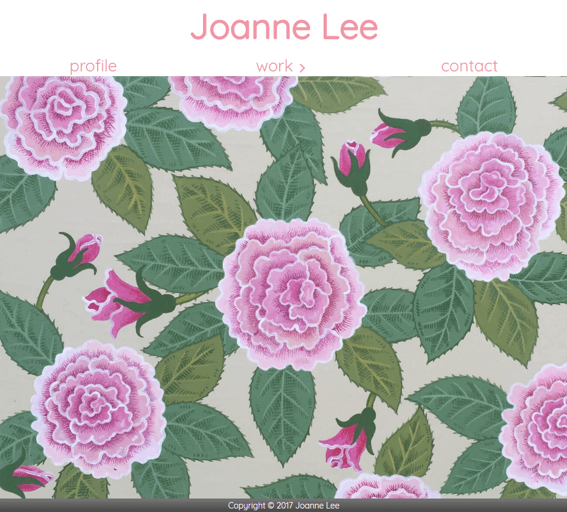

# Joanne Lee

This is Joanne's website, shows her works. Images are dynamically served from `Firebase storage` and lazily loaded using `IntersectionObserver` API. All resources are cached by `workbox` service worker that makes the web faster on next visit and even when user lost the internet. Also the web will be server-side-rendered to make it faster and easier to be found by search engines.



The website was built and deployed using following technologies: 
* [React](https://reactjs.org/): A JavaScript library for building user interfaces
* [Create React App](https://github.com/facebookincubator/create-react-app): a React application build tool
* [Workbox](https://workboxjs.org/): JavaScript libraries for Progressive Web Apps
* [Firebase](https://firebase.google.com/): cloud platform for storage, database, hosting and functions

[Visit the web!](https://react-joanne.web.app)

To build, run `yarn build:ssr` and `yarn serve` to test it on `localhost:5000`.
To deploy, run `firebase deploy` to deploy on the cloud.

```
// to install dependencies
yarn
// to debug on localhost:3000
yarn start
// to run tests
yarn test
// to build for production
yarn build:ssr
// to test on localhost:5000 with production build
yarn serve
```